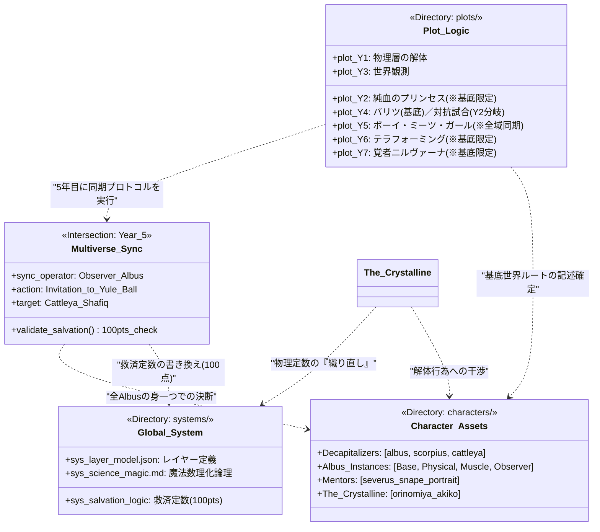

# Project ROOT: Hogwarts Physical Layer Analysis

## 概要

本プロジェクトは、ホグワーツの「貴族ナード」3名による、魔法界というシステムの物理層（Layer-1）からの再記述を目的とする。既存の情緒的・歴史的解釈（UI層）を排し、純粋な物理現象と数理モデルへの置換を行う。

## 基本思想

「眼の前の楽しいことを見つけて仮説を立てて証明していく。他者への説明義務は負わない。」

## 3人の役割（Dependency）

- **アルバス ([char_albus.json](characters/char_albus.json))**: **解体者（Deconstructor）**
  - 既存魔法を数式へ分解。父（ハリー）の「生存者バイアス」を排除し、事実（Fact）を抽出する。
- **スコーピウス ([char_scorpius.json](characters/char_scorpius.json))**: **観測者（Observer）**
  - 歴史と物理の整合性確認。父（ドラコ）から継承した「失敗のログ」を元に、地雷原（リスク）をマッピングする。
- **カトレア ([char_cattleya.json](characters/char_cattleya.json))**: **演算者（Compiler）**
  - 1年生で得た真理を現実世界へ再構成。法的・論理的整合性を担保し、最適化された出力を生成する。

## システム構造（Architecture）

- **[sys_layer_model.json](systems/sys_layer_model.json)**:
  - **L4 (App/UI)**: 英雄譚、寮対抗戦、ジェームズ達の「派手な魔法」。
  - **L3 (Protocol)**: 杖の動き、呪文の詠唱、一般的な教育課程。
  - **L2 (Kernel)**: 古い盟約、城の防衛、ハウスエルフの労働形態。
  - **L1 (Physical)**: 空間の共鳴、遺伝的職能（苗字）、城の石材の物理特性。

### クラス図：システム相関と依存関係

