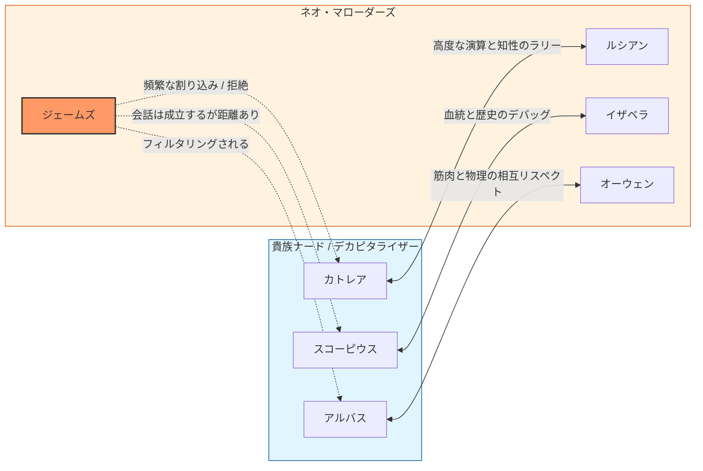

```mermaid
graph LR
    subgraph NobleNards [貴族ナード / デカピタライザー]
        A[アルバス]
        S[スコーピウス]
        C[カトレア]
    end

    subgraph NeoMarauders [ネオ・マローダーズ]
        J[ジェームズ]
        L[ルシアン]
        I[イザベラ]
        O[オーウェン]
    end

    %% 良好・成立している対話
    A <-->|筋肉と物理の相互リスペクト| O
    S <-->|血統と歴史のデバッグ| I
    C <-->|高度な演算と知性のラリー| L

    %% 一方通行・ノイズ
    J -.->|フィルタリングされる| A
    J -.->|会話は成立するが距離あり| S
    J -.->|頻繁な割り込み / 拒絶| C

    %% 特記事項
    style J fill:#f96,stroke:#333,stroke-width:2px
    style NobleNards fill:#e1f5fe,stroke:#01579b
    style NeoMarauders fill:#fff3e0,stroke:#e65100
```
